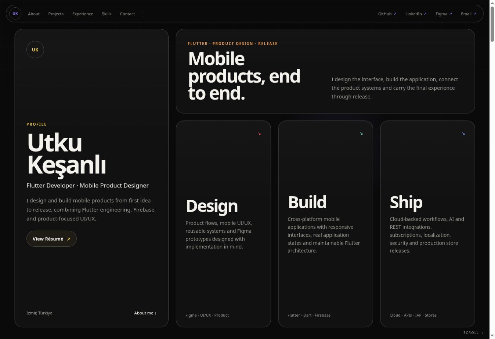

# Utku Keşanlı — Portfolio

Personal portfolio of a Flutter developer and mobile product designer, built with **Astro and TypeScript** and deployed to **GitHub Pages**.

**[Visit the live portfolio](https://utkukesanli.github.io/)**



## Features

- Responsive profile with a résumé PDF link.
- Design / Build / Ship cards navigating to related projects.
- TaleVD (App Store), Focial (Figma) and Evender (GitHub) links.
- Screenshot carousels, expandable project notes, experience, skills and contact sections.
- Typed content models, separating content from section components.
- Optimized TaleVD WebP images with dimensions and lazy loading. Carousels load neighbouring slides on demand and pause autoplay outside the viewport.

## Development

Use Node.js 22 (the same major version as CI) and npm.

```bash
npm ci
npm run dev
```

Astro serves the development site at `http://localhost:4321` by default.

| Command | Purpose |
| --- | --- |
| `npm ci` | Install exact dependencies from `package-lock.json` |
| `npm run dev` | Start the development server |
| `npm run check` | Check Astro and TypeScript diagnostics |
| `npm run build` | Generate the static site in `dist/` |
| `npm run preview` | Preview the production build locally |

Commit `package-lock.json` whenever dependencies change. Generated output and dependencies are excluded by `.gitignore`.

## Architecture and content

| Location | Responsibility |
| --- | --- |
| `src/pages/index.astro` | Page composition, document language and metadata |
| `src/components/` | Reusable cards, navigation and page sections |
| `src/data/projects.ts` | Project descriptions, links, screenshot metadata and details |
| `src/data/experience.ts` | Work experience and highlights |
| `src/data/skills.ts` | Skill groups |
| `src/data/` | Additional shared content such as social links |
| `src/styles/global.css` | Design tokens and shared styles |
| `public/projects/` | Project images served at `/projects/` |
| `public/Utku_Baran_Kesanli_Resume.pdf` | Résumé served by the profile link |
| `docs/` | Repository documentation images; excluded from the deployed site |

Use descriptive kebab-case names for new project images. Include meaningful alt text and actual dimensions in the project data. Remove obsolete files once references have been updated.

### Copyright

Copyright © 2026 Utku Keşanlı. All rights reserved.

The source code and original content of this portfolio are publicly available for viewing purposes only.

No permission is granted to reproduce, modify, redistribute, or use the original source code or content in other projects without prior written permission from the copyright holder.
5. Deploy the successful artifact with `actions/deploy-pages`.

In repository **Settings → Pages**, use **GitHub Actions** as the build and deployment source. This is a user site deployed at the domain root, so asset URLs are root-relative. Hosting beneath a repository subpath would also require updating Astro's base configuration and asset links.
